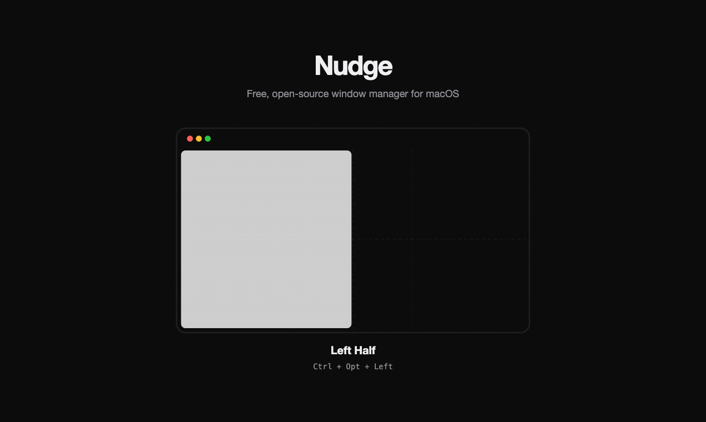

# Nudge

A free, open-source macOS window manager.

Nudge lets you snap, resize, and organize your windows with keyboard shortcuts and drag-to-edge gestures — no subscription required.

<p align="center">
  
</p>

---

## Features

- **Keyboard Shortcuts** — 18 actions for halves, quarters, thirds, maximize, center, and display moves
- **Drag-to-Snap** — Drag a window to a screen edge or corner to snap it into position
- **Customizable** — Remap any shortcut to your preference through the Settings panel
- **Menu Bar App** — Lives in your menu bar, always accessible, never in your way
- **Multi-Monitor Support** — Move windows across displays with a single keystroke

---

## Default Keyboard Shortcuts

| Action | Shortcut |
|--------|----------|
| Left Half | ⌃⌥← |
| Right Half | ⌃⌥→ |
| Top Half | ⌃⌥↑ |
| Bottom Half | ⌃⌥↓ |
| Top Left | ⌃⌥U |
| Top Right | ⌃⌥I |
| Bottom Left | ⌃⌥J |
| Bottom Right | ⌃⌥K |
| Left Third | ⌃⌥D |
| Center Third | ⌃⌥F |
| Right Third | ⌃⌥G |
| Left Two Thirds | ⌃⌥E |
| Right Two Thirds | ⌃⌥T |
| Maximize | ⌃⌥↩ |
| Center | ⌃⌥C |
| Restore | ⌃⌥⌫ |
| Next Display | ⌃⌥⌘→ |
| Previous Display | ⌃⌥⌘← |

All shortcuts can be remapped in **Nudge → Settings → Shortcuts**.

---

## Requirements

- macOS 11 (Big Sur) or later
- Xcode 14+
- [xcodegen](https://github.com/yonaskolb/XcodeGen)

---

## Installation

### Download

Download the latest DMG from [GitHub Releases](https://github.com/mikusnuz/nudge/releases/latest). Open, drag to Applications, done.

Signed & notarized by Apple — no Gatekeeper warnings.

### Homebrew

```bash
brew tap mikusnuz/tap
brew install nudge-run
```

### Build from Source

```bash
git clone https://github.com/mikusnuz/nudge.git
cd nudge
brew install xcodegen
xcodegen generate
open Nudge.xcodeproj
```

Press **⌘R** to build and run.

On first launch, grant Nudge **Accessibility** permissions when prompted in System Settings → Privacy & Security → Accessibility.

---

## License

MIT — see [LICENSE](LICENSE) for details.
